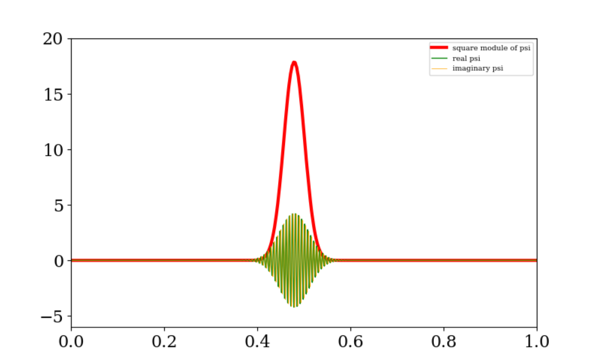
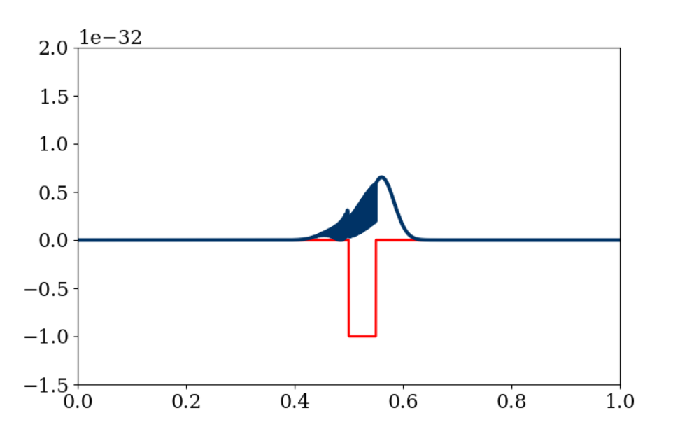
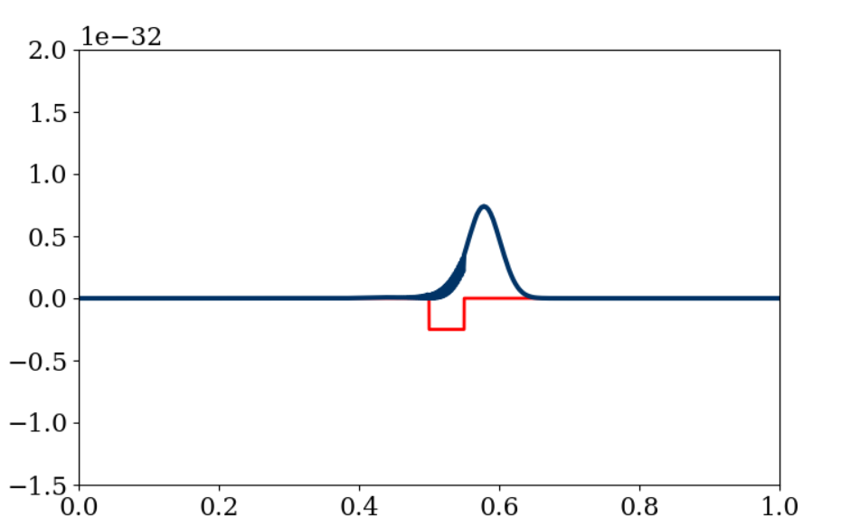
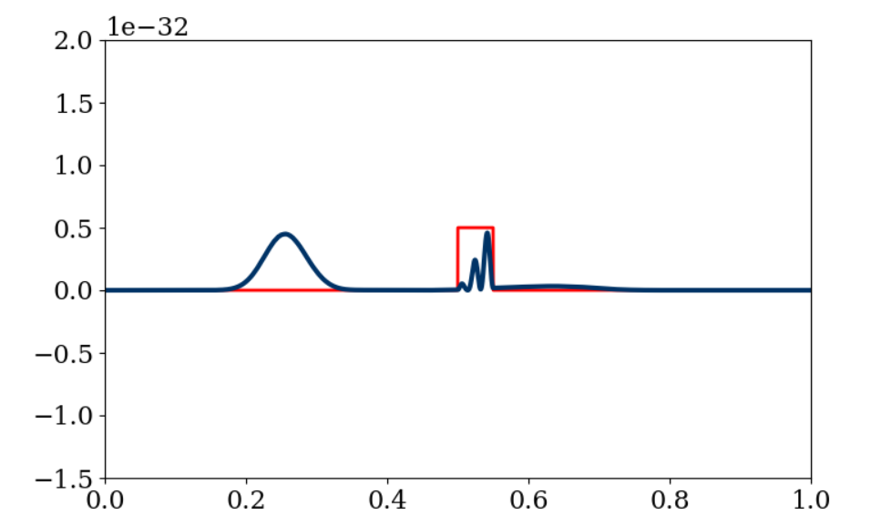
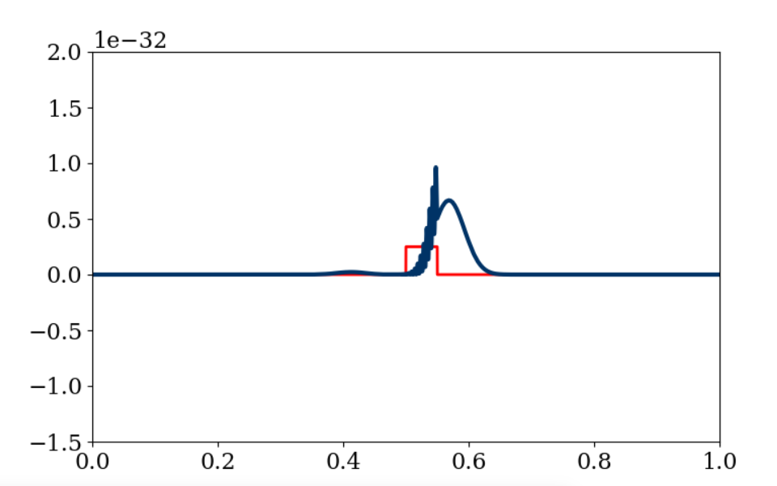
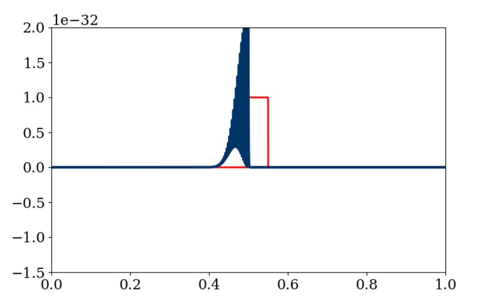

# Tunneling in un sistema quantistico

## Un rapidissimo sguardo alla meccanica quantistica

Nel mondo quantistico, lo stato di una particella non è più descritto semplicemente da una funzione di coordinate $\mathbf{x}(t)$, che specifica la sua posizione al tempo $t$, ma da una *funzione d'onda* $\psi (\mathbf{x}, t)$, che dice qual è l'**ampiezza** della particella al tempo $t$ nella posizione $\mathbf{x}$.

Il calcolo dell'evoluzione temporale della funzione $\psi(\mathbf{x}, t)$ è reso possibile grazie all'utilizzo dell'equazione di Schrödinger

$$ i\hbar\frac{\partial \psi}{\partial t} = -\frac{\hbar^2}{2 M}\nabla^2 \psi + V(\mathbf{x}) \psi $$

Semplificazione dell'equazione di Schrödinger da due dimensioni a una dimensione

$$ i\hbar\frac{\partial \psi}{\partial t} = -\frac{\hbar^2}{2 M}\frac{\partial^2 \psi}{\partial x^2} $$

## Simulazione nel tempo

Cercheremo di simulare l'evoluzione della forma d'onda utilizzando una semplice differenza diretta nel tempo, ed uno schema centrale nello spazio: in altre parole, introdurremo le seguenti due approssimazioni

$$
\frac{\partial\psi(x,t)}{\partial t} \simeq \frac{\psi(x,t+\Delta t) - \psi(x,t)}{\Delta t} \quad (1)
$$

$$
\frac{\partial^2\psi(x,t)}{\partial x^2} \simeq \frac{\psi(x+\Delta x,t) - 2 \psi(x,t) + \psi(x-\Delta x, t)}{\left(\Delta x\right)^2} \quad (2)
$$

Si possono percorre due strade qui: o si lavora direttamente solo con numeri complessi, oppure si scrivono due equazioni separate e accoppiate per la parte reale e quella immaginaria

$$
\psi(x,t) = \psi_R(x,t) + i \psi_I(x,t)
$$

quindi

$$
\begin{aligned}
\hbar \frac{\partial\psi_R(x,t)}{\partial t} &= -\frac{\hbar^2}{2 M}\frac{\partial^2\psi_I(x,t)}{\partial x^2} + V(x)\psi_I(x,t) \\
\hbar \frac{\partial\psi_I(x,t)}{\partial t} &= +\frac{\hbar^2}{2 M}\frac{\partial^2\psi_R(x,t)}{\partial x^2} - V(x)\psi_R(x,t)
\end{aligned}
$$

## Obiettivo del progetto

Il principale scopo del progetto è simulare l'avanzamento del tempo della particella lungo una barriera di potenziale $V_0$.  A titolo di esempio riporto alcune immagini catturate durante il processo di simulazione che ritraggono il comportamento dell'onda mentre attraversa diverse bariere di potenziale $V_0$.

1. $V_0 = 0$

2. $V_0 = - 2\,E_0$

3. $V_0 = - \frac{1}{2} E_0$

4. $V_0 = + E_0$

 

5. $V_0 = + \frac{1}{2} E_0$

6. $V_0 = + 2\,E_0$

## Riferimenti
Goldberg, Schey and Schwartz, [*Computer Generated Motion Pictures of One-Dimensional Quantum-Mechanical Transmission and Reflection Phenomena*](http://ergodic.ugr.es/cphys/lecciones/SCHROEDINGER/ajp.pdf), American Journal of Physics **35** (1967) 177-186

